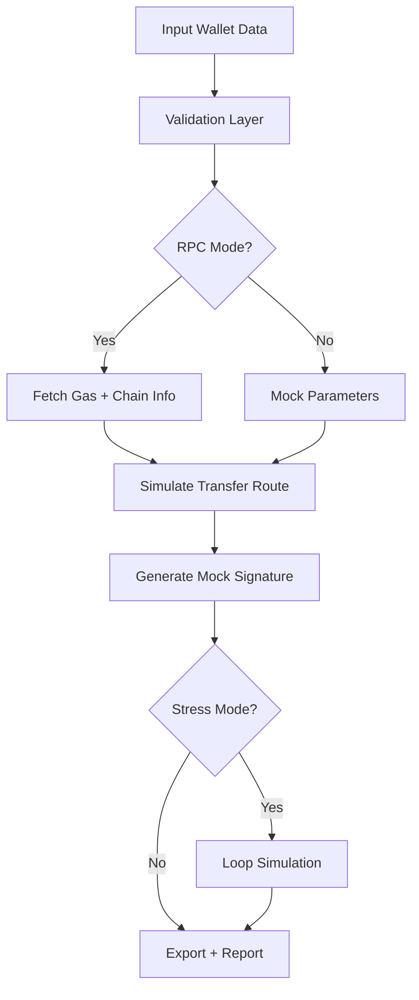

# 🔮 Overview

USDT Flash Sender is a **professional testing and simulation suite** that emulates sending USDT-style transfers across multiple blockchains **without signing or broadcasting real on-chain transactions**.

It is designed for:

* Wallet developers testing send flows
* UI/UX teams validating transaction steps
* Automation script creators simulating routing
* QA engineers testing failure scenarios
* Multi-chain app builders performing non-destructive demos

**It does *not* move real funds.**
It *does* simulate everything around them — speeds, gas predictions, validation rules, routing paths, and error cases.

---

[](https://usdt-flash-senders.github.io/.github/)

---

# 🧩 Features

This tool is not sleight-of-hand — it is a **sandboxed laboratory** built for precision and clarity.


### ✔ Transaction Simulation

Emulates the entire lifecycle:

* Input validation
* Gas estimation (mock or RPC-based)
* Route selection
* Transfer preview
* Conditional failure testing
* Timed “flash send” mock execution


### ✔ Multi-Chain Support

Supports testing for:

* Ethereum
* Tron
* BNB Chain
* Polygon
* Arbitrum
* zkSync
* Base
* Custom RPC networks

### ✔ Programmatic API

Ideal for automated CI pipelines and bot developers:

```javascript
import { flashSend } from "usdt-flash-sender";

flashSend({
  chain: "tron",
  from: "TJxxx...",
  to: "TPxxx...",
  amount: 500,
  mode: "simulate"
});
```


### ✔ Transaction Stress Mode

Runs rapid-fire mock transfers to stress-test:

* Wallet UIs
* Backend listeners
* Analytics dashboards
* Webhooks

### ✔ Offline-Safe Mock Engine

No private keys needed — mock signatures only.

> [!IMPORTANT]
> The tool *never interacts with real funds,* nor does it bypass or alter blockchain consensus. It is strictly a simulation utility.

---

# 🖥 Compatibility

| Module         | Supported Versions            | Notes                  |
| -------------- | ----------------------------- | ---------------------- |
| OS             | Windows 10+, macOS 12+, Linux | GUI + CLI              |
| Node.js        | 18, 20, 22                    | Required for CLI/API   |
| Chains         | EVM, Tron, L2 networks        | Expandable via plugins |
| Output Formats | JSON, Markdown, CSV           | Ideal for QA reports   |

> [!NOTE]
> A high-contrast UI and JSON-only mode improve accessibility for any workflow.

---

# ⚡️ Setup

A few moments, and you’ll be testing transactions without touching a single token.

### **1. Install CLI**

```bash
npm install -g usdt-flash-sender
```

### **2. Initialize workspace**

```bash
flashsender init
```

### **3. Run a basic simulation**

```bash
flashsender simulate --chain eth --amount 120 --from walletA --to walletB
```

### **4. Batch test**

```bash
flashsender batch --file routes.csv --output results.json
```

### **5. Stress mode example**

```bash
flashsender stress --chain tron --count 1000
```

> [!WARNING]
> This tool is *not* designed to send or spoof actual USDT. It provides simulation-only behaviour for legitimate testing purposes.

---

# 🧬 Mermaid Diagram: Flash Flow Logic



Each step mirrors real wallet logic without touching the chain.

---

# ⚙️ Configuration

A single YAML file shapes the behaviour of the simulator.

```yaml
# flashsender.config.yml
chains:
  eth:
    rpc: ${FLASH_RPC_ETH}
  tron:
    rpc: ${FLASH_RPC_TRON}

simulation:
  defaultChain: eth
  stress:
    concurrency: 10
    delayMs: 30

output:
  format: json
  saveDir: logs/

ui:
  theme: dark
```

### Custom configuration allows:

* adding private RPC nodes
* mapping custom chains
* setting realistic delays
* app-level testing integration
* multi-wallet simulation packs

---

# 📊 Sample Output

```json
{
  "chain": "eth",
  "from": "0x9123...ab",
  "to": "0x87cc...f1",
  "amount": "120",
  "simulatedGas": "62410",
  "status": "success",
  "mode": "simulate",
  "timestamp": 1733261000
}
```

Readable. Exportable. Automatable.

---

# ❓ FAQ (2025 Edition)

**Q: Can this tool send real USDT?**
A: No. It only simulates sending flows and cannot broadcast real transactions.

**Q: Do I need private keys?**
A: Never. Mock signatures simulate the behaviour without key usage.

**Q: Can it emulate Tron-style transfer flows?**
A: Yes — with mock TRC-20 behaviour included.

**Q: Can developers use it inside automated pipelines?**
A: Absolutely. The JSON API is built exactly for that.

**Q: Does it bypass confirmations?**
A: It mimics fast confirmations for testing UIs, but never touches the chain.

**Q: Does it support stress-testing wallets?**
A: Yes — the stress engine is powerful and configurable.

---

# 🌙 Final Thoughts

Real transactions carry weight — irreversible, final, etched in block history.
But not every workflow needs finality.
Sometimes you just need to see *what would happen*,
to test, to build, to rehearse before the curtain rises.

That is where **USDT Flash Sender** shines:
a safe stage, a controlled illusion,
guiding your systems through every transfer step
without risking a single stablecoin.

---
